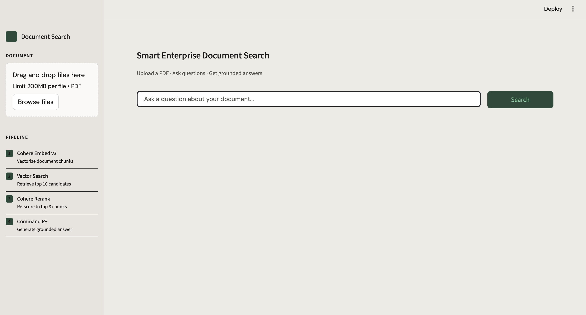

# Smart Enterprise Document Search
### RAG Pipeline powered by Cohere Embed v3 · Rerank · Command R+

An end-to-end Retrieval-Augmented Generation (RAG) pipeline that lets you upload PDF documents and ask questions about them in natural language. Built using Cohere's full model stack.

---

## Demo
Upload any PDF → Ask a question → Get a grounded, accurate answer



---

## How It Works

```
PDF Upload
    ↓
parse_pdf()       — extract raw text from all pages
    ↓
chunk_text()      — split into 400-word overlapping chunks
    ↓
embed_chunks()    — Cohere Embed v3 → float vectors
    ↓
[User asks a question]
    ↓
embed_query()     — Cohere Embed v3 → query vector
    ↓
vector_search()   — cosine similarity → top 10 candidates
    ↓
rerank_chunks()   — Cohere Rerank → top 3 best matches
    ↓
generate_answer() — Cohere Command R+ → final grounded answer
```

---

## Features

- Upload multiple PDFs simultaneously and query across all of them
- Semantic search using dense vector embeddings
- Precision re-scoring with Cohere Rerank
- Grounded answer generation — model only answers from document context
- MCQ reasoning capability — evaluates each option and explains why others are wrong
- Web search fallback via DuckDuckGo when document lacks sufficient detail
- Clean Streamlit UI with persistent session state

---

## Tech Stack

| Component | Technology |
|---|---|
| Embedding | Cohere Embed v3 (`embed-english-v3.0`) |
| Reranking | Cohere Rerank (`rerank-english-v3.0`) |
| Generation | Cohere Command R+ (`command-r-plus-08-2024`) |
| Vector Search | Cosine Similarity (NumPy) |
| Web Search Fallback | DuckDuckGo Search |
| PDF Parsing | pypdf |
| UI | Streamlit |

---

## Getting Started

### Prerequisites
- Python 3.9+
- A free Cohere API key from [dashboard.cohere.com](https://dashboard.cohere.com)

### Installation

```bash
# Clone the repository
git clone https://github.com/FartunAraye/smart-doc-search.git
cd smart-doc-search

# Create and activate virtual environment
python3 -m venv venv
source venv/bin/activate

# Install dependencies
pip install cohere pypdf streamlit python-dotenv numpy duckduckgo-search
```

### Configuration

Create a `.env` file in the root directory:
```
COHERE_API_KEY=your_cohere_api_key_here
```

### Run

```bash
streamlit run app.py
```

Open your browser at `http://localhost:8501`

---

## Usage

1. Upload one or more PDF documents using the sidebar
2. Wait for the document to be indexed (chunked and embedded)
3. Type your question in the search bar
4. Get a grounded answer based on your documents

### Example Questions
- *"What is the main finding of this paper?"*
- *"Summarize the conclusion"*
- *"What methodology was used?"*
- *"In a dynamically linked library, ____. A) ... B) ... C) ... D) ..."*

---

## Project Structure

```
smart-doc-search/
├── app.py          # Streamlit UI layer
├── rag_engine.py   # Core RAG pipeline logic
├── .env            # API keys (not committed)
├── .gitignore
└── README.md
```

---

## Architecture Decisions

- **Overlapping chunks** (400 words, 80 word overlap) prevent context loss at chunk boundaries
- **Two-stage retrieval** (vector search → rerank) balances speed and precision
- **Low temperature (0.2)** on generation keeps answers factual and grounded
- **Web search fallback** handles questions where document context is insufficient

---

## Built With

- [Cohere API](https://cohere.com) — Embed, Rerank, Command R+
- [Streamlit](https://streamlit.io) — UI framework
- [pypdf](https://pypdf.readthedocs.io) — PDF parsing
- [DuckDuckGo Search](https://pypi.org/project/duckduckgo-search/) — Web fallback
